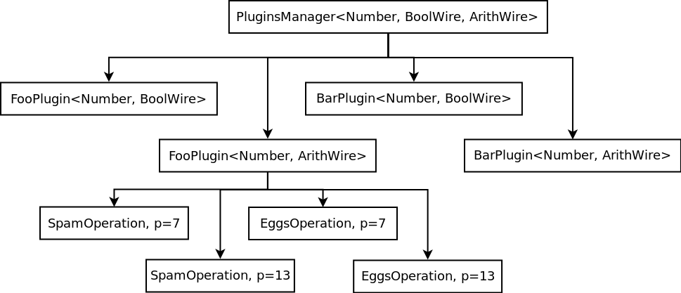

= Plugins Intro
:source-highlighter: pygments
ifndef::src-rel-dir[]
:src-rel-dir: 
endif::[]

This chapter is organized into sub-chapters for each plugin.
This introduction will go over the use of plugins at a broad level, then each sub-chapter will look at the specifics of a given plugin.

In each sub-chapter, we will start with the plugin's in-IR usage, then get into it's pass:[C++] implementation.

It should be noted that Plugins are, for the time being, a Circuit-IR feature.
The use of plugins with the Translation-IR is not yet under development, and may use a somewhat different API from the Circuit-IR.

== IR Plugins
A plugin allows a backend to implement functionality beyond the confines of the IR.
This means that additional coordination is necessary between the backend and frontend.
Users may take advantage of the xref:#builtin-plugins[specified/builtin plugins], use the https://raw.githubusercontent.com/sieve-zk/ir/main/v2.1.0/circuit-ir/circuit-ir-v2.1.0.pdf#section.6[Circuit Configuration Communication (CCC)], or otherwise the plugin's semantics and identifiers must be agreed to out of band.

In the IR, a plugin is identified by a name.
The name must be declared in the circuit header, between the `circuit` keyword and the first `@type` declaration.
This gives the backend a chance to perform setup tasks.

----
/* ... */
circuit;

@plugin my_plugin_1;

@type /* ... */
----

Multiple plugins may also be declared.

----
/* ... */
circuit;

@plugin my_plugin_1;
@plugin my_plugin_2;
/* More plugins, as necessary */

@type /* ... */
----

Plugin functionality takes the place of a Circuit-IR function.
The IR function-signature is used, as expected.
However, rather than having a list of gates for its body, it has a plugin binding.
The signature declares the plugin's functionality to the IR, whilst the binding configures the backend-specific functionality.

Here is an example.
In the plugin binding, two identifiers are required -- the plugin name and operation -- then a mix of identifiers and numbers are allowed.
The list is to be interpreted by the backend.

----
@function(function_name, @out: 0:4, @in: 0:4, 0:4)
  @plugin(my_plugin_1, some_operation, a, 1, b, 2, c, 3);
----

Plugins also allow the definition of non-field types.
These types are declared in the same section as field types, but rather than having a prime, they have a plugin binding.

----
@type field 7;
@type @plugin(my_plugin_2, my_plugin_type, a, 1, b, 2, c, 3);
----

Plugin types may then be used as arguments to plugin functions.
If it makes sense for the plugin's functionality, they could also be used as inputs to gates.

[#implementing_plugins]
== Implementing Plugins in WizToolKit
In the IR, plugins take the place of a function's body.
However, the WizToolKit interface does not entirely expose functions to implementors.
Rather, it encapsulates the minutia of invocation while exposing a system to search and retrieve plugin functionality when needed.

The xref:{src-rel-dir}/src/main/cpp/wtk/plugins/Plugin.h[`#include <wtk/plugins/Plugin.h>`] interface exposes a `wtk::plugins::PluginsManager<Number_T, Wire_Ts...>` for managing and, as needed, retrieving the appropriate plugins, as well as the `wtk::plugins::Plugin<Number_T, Wire_T>` interface to encapsulate a plugin.
However, the heart of the interface is the `wtk::plugins::Operation<Number_T>` which may be subclassed to implement specific plugin operations.
These classes form somewhat of a heirarchy which is traversed to retrieve the functionality referred to by a plugin binding.

The following are the criteria used for retrieving plugin functionality.

. *Plugin Name*: The first required parameter of the plugin-binding refers to the name of a group of associated functionality.
. *Dominant Type*: This is determined from the function signature by looking at each input range and then each output range to find a type (e.g. field or prime) which is supported by the plugin.
  Typically all parameters to a plugin function will have all the same type, however this is not always the case.
  For this reason, the input types are scanned for the first input type which is supported by the named plugin.
  If the inputs do not turn up a supported type, outputs are scanned, and failing this an error occurs.
  The dominant type actually has two subcriteria:
.. *Type Index*: The index used within the IR to refer to a type
.. *`Wire_T` template*: The template type used by the backend's pass:[C++] code for wire storage.
. *Operation*: Once the plugin name and dominant type are selected, the second required parameter of the plugin-binding is used to select the appropriate functionality.

The following example shows a plugin heirarchy with `foo` and `bar` plugins, for each of the `BoolWire` and `ArithWire` `Wire_T` template arguments.
Within the `FooPlugin<Number, ArithWire>` plugin, shown are `spam` and `eggs` operations for types with primes _7_ and _13_.

.An example plugin heirarchy

Configuring plugins is a multi-step process.

. Instantiate a plugins manager.
. Allocate a plugin objects.
. Add types/backends to the plugins manager, these will propagate to the plugins.
. As required by the circuit, operations will be requested from plugins manager and delegated to the appropriate plugin.

First, allocate a `wtk::plugins::PluginsManager<Number_T, Wire_Ts...>` with your plaintext numeric type (`Number_T`) and the all the ZK wire types (`Wire_Ts...`) you wish to use.
For this example, we'll continue with the `Number`, `BoolWire`, and `ArithWire` types.

[source,c++]
----
wtk::plugins::PluginsManager<Number, BoolWire, ArithWire> plugins_manager;
----

Next, check which plugins have been requested in the IR header.
The list of plugins is a vector of strings which you can get from the circuit parser (`pass:[circuit_parser->plugins]`, found in xref:{src-rel-dir}/src/main/cpp/wtk/circuit/Parser.h[`#include <wtk/circuit/Parser.h>`]).
You will need to allocate a plugin for both the `BoolWire` and `ArithWire` types.
We have found a "loop and if" construct is most convenient for allocating plugins.

[source,c++]
----
for(size_t i = 0; i < circuit_parser->plugins.size(); i++)
{
  if("foo" == circuit_parser->plugins[i])
  {
    std::unique_ptr<wtk::plugins::Plugin<Number, BoolWire>> bool_foo =
      new FooPlugin<Number, BoolWire>(/* ... */);
    plugins_manager.addPlugin("foo", std::move(bool_foo));

    std::unique_ptr<wtk::plugins::Plugin<Number, ArithWire>> arith_foo =
      new FooPlugin<Number, ArithWire>(/* ... */);
    plugins_manager.addPlugin("foo", std::move(arith_foo));
  }
  else if("bar" == circuit_parser->plugins[i])
  {
    std::unique_ptr<wtk::plugins::Plugin<Number, BoolWire>> bool_bar =
      new BarPlugin<Number, BoolWire>(/* ... */);
    plugins_manager.addPlugin("bar", std::move(bool_bar));

    std::unique_ptr<wtk::plugins::Plugin<Number, ArithWire>> arith_bar =
      new BarPlugin<Number, ArithWire>(/* ... */);
    plugins_manager.addPlugin("bar", std::move(arith_bar));
  }
  else
  {
    printf("unrecognized plugin %s\n", circuit_parser->plugins[i].c_str());
    exit(1);
  }
}
----

Next, xref:../2_nails.adoc#invoking_nails[as backends are added to the NAILS Interpreter], also add each backend to the plugins manager.

[source,c++]
----
for(size_t i = 0; i < circuit_parser->types.size(); i++)
{
  /* Create the appropriate backend and streams */

  interpreter.addType(my_backend, public_in_stream, private_in_stream);
  plugins_manager.addBackend(static_cast<wtk::type_idx>(i), my_backend);
}
----

When the circuit begins processing, as plugin-functions are encountered, your Plugin wil be requested to create (or retrieve preexisting) `wtk::plugins::Operation<Number_T>` objects.

[#builtin-plugins]
== Builtin Plugins
While you could implement the raw `wtk::plugins::Plugin<Number_T, Wire_T>`, we suggest using the `wtk::plugins::SimplePlugin<Number_T, Wire_T>` interface (see xref:{src-rel-dir}/src/main/cpp/wtk/plugins/SimplePlugin.h[`#include <wtk/plugins/SimplePlugin.h>`] (TODO) or using one of the following built in plugin interfaces.

* xref:./1_iter_v0.adoc[`iter_v0`]
* xref:./1_mux_v0.adoc[`mux_v0`]
* xref:./1_ram_arith_v0.adoc[`ram_arith_v0`]
* xref:./1_ram_bool_v0.adoc[`ram_arith_v0`]
* xref:./1_wizkit_vectors.adoc[`wizkit_vectors`]
* xref:./1_wizkit_arithmetic.adoc[`wizkit_arithmetic`]
